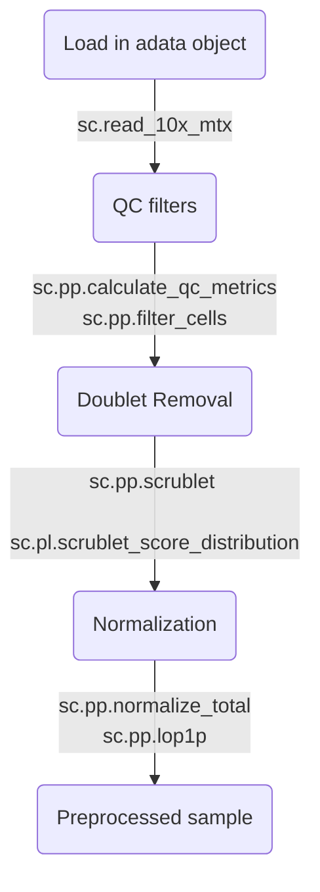
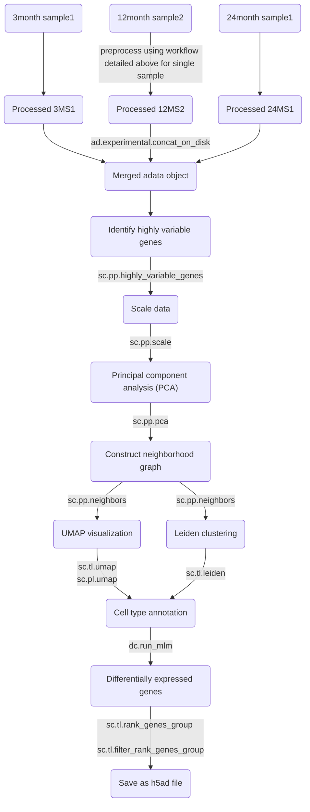
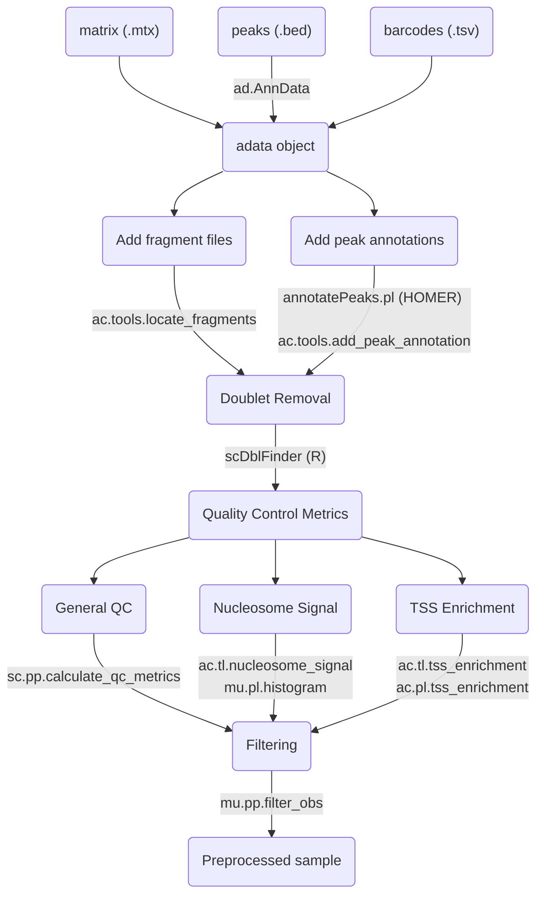

**Note**: The .py files are coverted from .ipynb Jupyter notebooks using *jupytext* prior to commit.
# Data download
- **Data sources**: [GSE277702](https://www.ncbi.xyz/geo/query/acc.cgi?acc=GSE277702) for cell-ranger processed data files and [zenodo](https://zenodo.org/records/14888193) for scATAC-seq fragment files and R source scripts
- **data_download.py**: Downloading raw data files from GEO repository
-  **generate_feature_tsv.py**: Recreating features.tsv files from reference genome annotations due to them not being included in GEO repository
# scRNA-seq
## Single sample
- **scRNA_pilot_workflow.py**: Example notebook for processing a single scRNA-seq sample
- **/scripts/preprocessing.py**: Wrapper functions for preprocessing a single sample.

> sc -> Scanpy
> ad -> Anndata
> dc -> decoupler

## Multi samples
- **scRNA_processing.py**: Notebook for merging all scRNA-seq samples and performing downstream tasks like dimensional reduction, clustering, cell type annotations, and identification of DEGs.  

# scATAC-seq
## Single sample
- **scATAC_pilot_workflow.py**: Example notebook for processing a single scATAC-seq sample
- **/scripts/scatac_preprocessing.py**: Wrapper functions for preprocessing a single scATAC-seq sample.
- **/scripts/scDblFinder_script.R**: R script for running scDblFinder

> sc -> Scanpy  
> ad -> Anndata  
> mu -> muon  
> ac -> mu.atac

## Multi samples